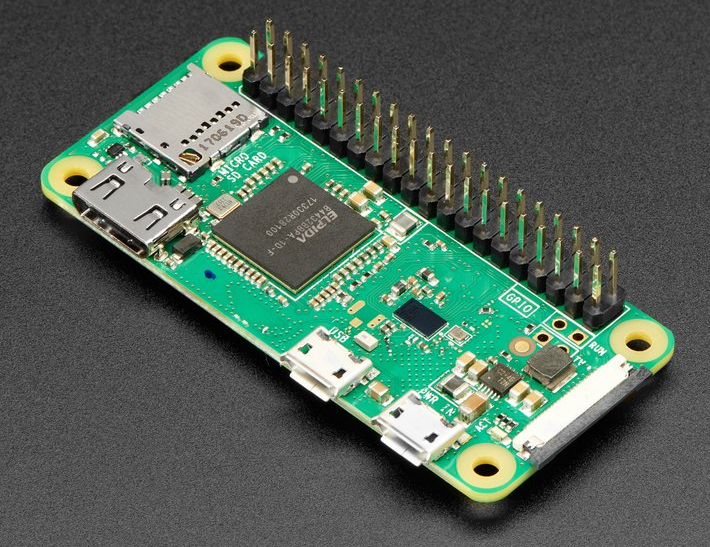
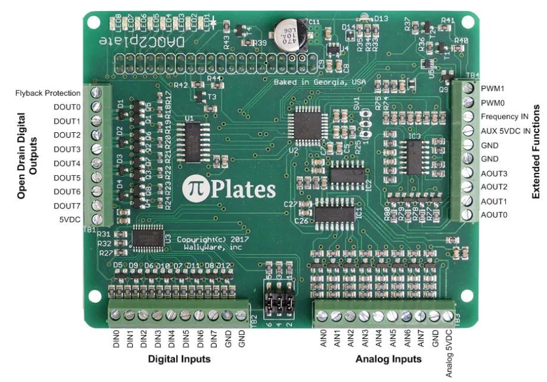
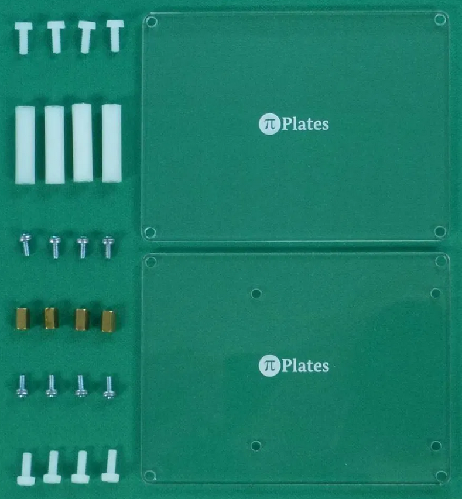
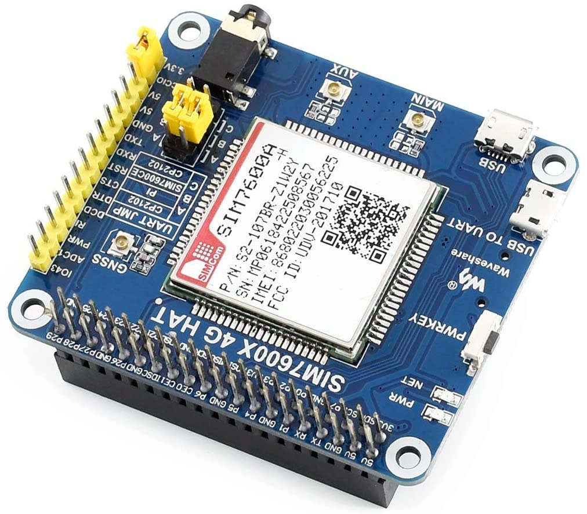
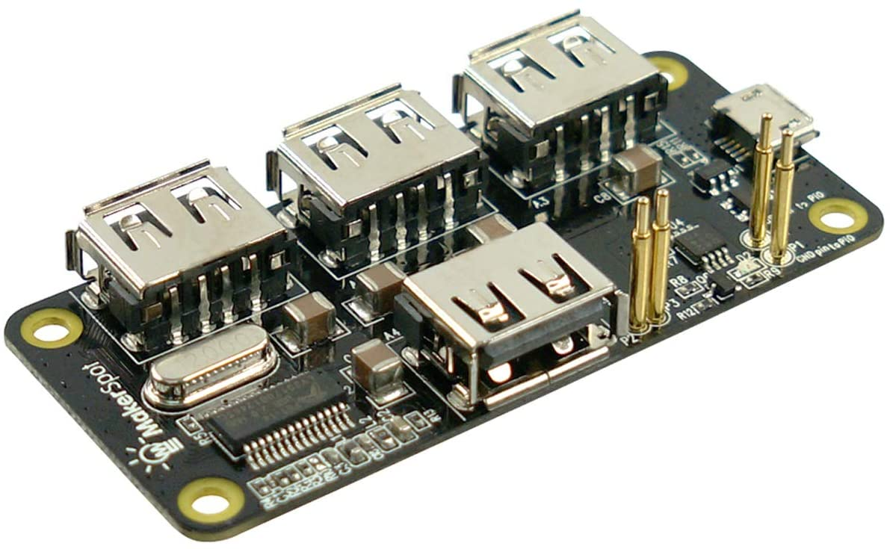
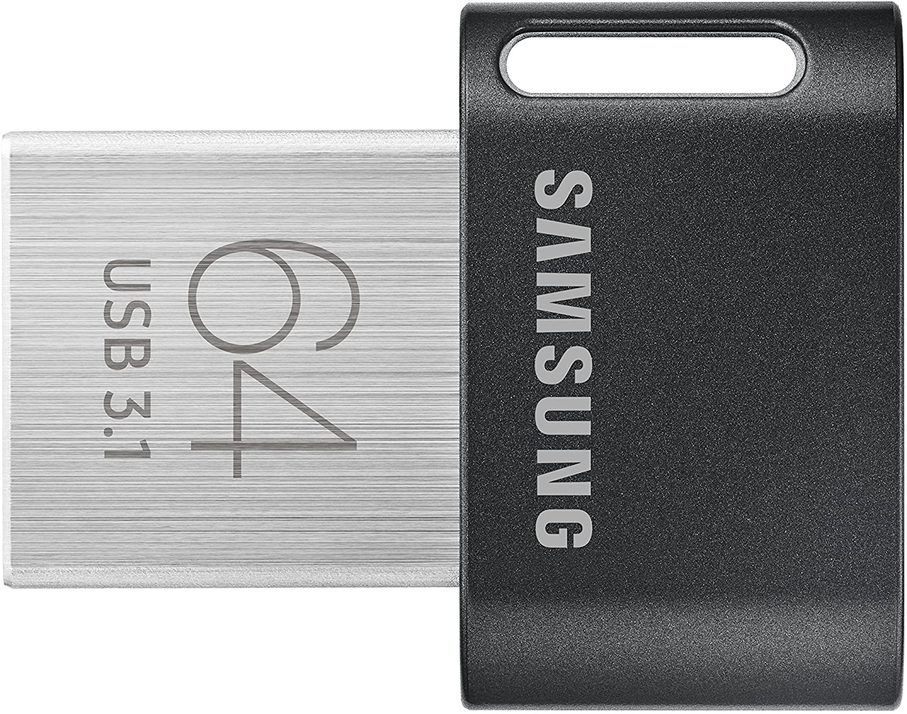
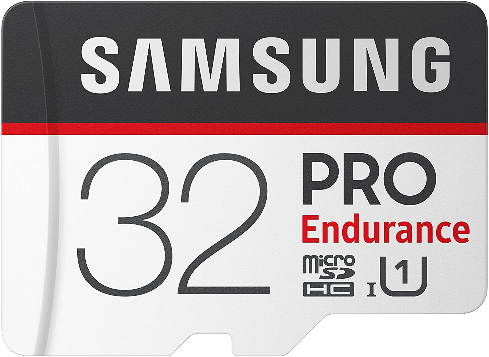
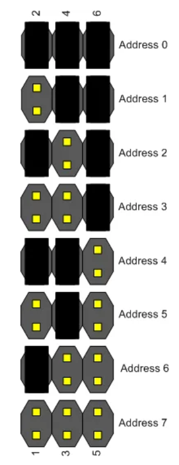

# Overview

The current version of the system consists of both the hardware and software components required to perform the specified actions.

# Table of Contents
---
1. [Components](#components)
2. [Assembly](#assembly)
  - [DAQC2plate Address Selection](#daqc2plate-address-selection)

## Components

- 1x [Raspberry Pi Zero W](#raspberry-pi-zero)
- 2x [Pi-Plates DAQC2plate](#pi-plates-daqc2plate)
- 1x [Pi-Plates CASEplate](#pi-plates-caseplate)
- 1x [4G/3G/GSM/GNSS/LTE CAT4 HAT for Raspberry Pi](#4g/3g/gsm/gnss/lte-cat4-hat-for-raspberry-pi)
- 1x [MakerSpot 4-Port Stackable USB Hub HAT for Raspberry Pi Zero](#makerspot-4-port-stackable-usb-hub-hat-for-raspberry-pi-zero)
- 1x [Samsung MUF-64AB/AM FIT Plus 64GB - USB 3.1 Flash Drive](#samsung-muf-64ab/am-fit-plut-64gb---usb-3.1-flash-drive)
- 1x [Samsung PRO Endurance 32GB MicroSD Card](#samsung-pro-endurance-32gb-microsd-card)
- [Sundries](#sundries)

>### [Raspberry Pi Zero W](https://www.raspberrypi.org/products/raspberry-pi-zero-w/)
 
>
>### [Pi-Plates DAQC2plate](https://pi-plates.com/daqc2r1/)
 
>
>### [Pi-Plates CASEplate](https://pi-plates.com/baser1/)
 
>
>### [4G/3G/GSM/GNSS/LTE CAT4 HAT for Raspberry Pi](https://www.robotshop.com/en/4g-3g-gsm-gnss-lte-cat4-hat-raspberry-pi.html)
 
>
>### [MakerSpot 4-Port Stackable USB Hub HAT for Raspberry Pi Zero](https://www.amazon.com/MakerSpot-Stackable-Raspberry-Connector-Bluetooth/dp/B01IT1TLFQ/ref=sr_1_4?dchild=1&keywords=raspberry+pi+zero+usb+hub&qid=1598892276&sr=8-4)
 
>
>### [Samsung MUF-64AB/AM FIT Plus 64GB - USB 3.1 Flash Drive](https://www.amazon.com/dp/B07D7P4SY4/ref=twister_B08DX677M8?_encoding=UTF8&psc=1)
 
>
>### [Samsung PRO Endurance 32GB MicroSD Card](https://www.amazon.com/Samsung-Endurance-32GB-Micro-Adapter/dp/B07B98GXQT/ref=sr_1_1?dchild=1&keywords=samsung+pro+endurance+32gb&qid=1598642971&s=electronics&sr=1-1)
 
>
>### [Sundries]
The units do not come with enough risers/spacers to build a secure unit.  If you want to build a secure unit and have spacers/connectors between each component, I suggest building the unit and then measuring and acquiring appropriate spacers.

## Assembly
The benefits of using a Raspberry Pi for the project, is that the components are made to simply stack on top of each other.

Starting with the CASEplate, clip the units into each other, one on top of the other in the following order.

1. PiPlates CASEplate (1st half)
2. MakerSpot USB hub (and insert the USB-thumb drive)
3. Raspberry Pi Zero W (and insert the micro SD-card)
4. 4G/3G/GSM/GNSS/LTE CAT4 HAT
5. 1st Pi-Plates DAQC2-plate (attach any analog sensor wires before attaching the second DAQC2plate)
6. 2nd Pi-Plates DAQC2-plate (and consecutive plates.  Remember to update the address information for each plate *see image below for addressing information*)
7. PiPlates CASEplate (2nd half)

### DAQC2plate Address Selection
 
