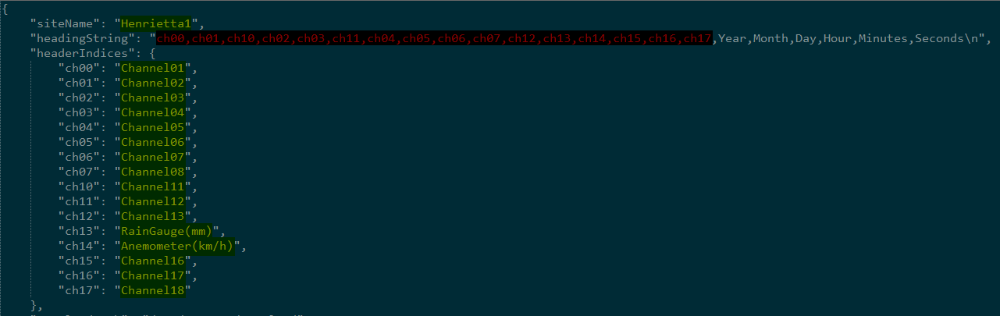
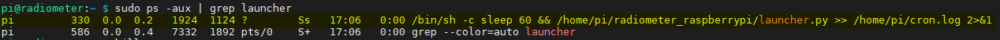
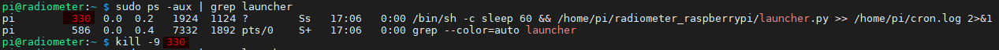
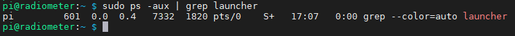

# Raspberry Pi-based Radiometer User Manual
---
The user manual is a basic guide explaining how to use the radiometer.  It contains the final steps required for implementation of the unit after it has been built using the [Component and Construction](Component-and-Construction.md) and installed using the [RaspberryPi-Installation](RaspberryPi-Installation.md) document.

# Table of Contents
---
* [Using the Raspberry Pi-based radiometer](#using-the-raspberry-pi-based-radiometer)
  * [Setting the Site Name and Heading Order](#setting-the-site-name-and-heading-order)  
  * [Launch the Program at Boot](#launch-the-program-at-boot)
  * [Stopping the Program after Boot](#stopping-the-program-after-boot)
  * [Changing the Password](#changing-the-password)

# Using the Raspberry Pi-based radiometer
---
Connect a screen and keyboard to the unit, then connect the unit to a power source.  After the unit has botted to the login screen, log in with the following credentials.

```
username: pi
password: raspberry
```

These are the default login credentials for the Raspberry Pi OS.

## Setting the Site Name and Heading Order
---
In order for the automatic upload of data to work, you need to specify a *Site Name* for the unit.  This is done by editing the **radiometer.json** file located in the project etc directory.  If you followed the installation instructions outlined in the [RaspberryPi-Installation](RaspberryPi-Installation.md), or used the ISO file (only available in the root of the private repository), the project should be in the pi home directory: /home/pi/radiometer_raspberrypi.

Open the file with your favorite text editor, and change the "siteName" index value accordingly.

<br>

You can change any of the values highlighted in **YELLOW** as the remaining values represent the heading you will see in your data file.

The *chXX* values represent the analog input channels on the PiPlates DAQC2plates.  The first numerical value in the index (ch**0**0) represents the PiPlates board to reference.  The second numerical value (ch0**0**) represents the pin that is being used.  Therefore:

> ch00

represents board 0, pin 0

> ch05

represents board 0, pin 5, AND

> ch13

represents board 1, pin 3.

You can change the order of the headings **highlighted in red** in the *headingString*, as that merely changes the order in which values are placed in the document.

## Launch the Program at Boot
Because the units will be deployed in the field, without being connected to a screen or keyboard, we need to configure it to launch the program on boot.  In order to launch the program at boot time, we need to add a line to the *crontab*.

```
sudo crontab -e
```

The following line instructs *cron* to launch the program at boot time and create a log file of the program launch process in the pi home directory.  If this is a fresh installation, add it at the bottom of the opened file.  If you are using the supplied ISO file (only available in the private repository), simply uncomment it.

```
@reboot sleep 60 && /home/pi/radiometer_raspberrypi/launcher.py >> /home/pi/cron.log 2>&1
```

## Stopping the Program after Boot
---
If the system is configure to run at boot time (from the previous section) you would have to manually stop the program before you can make changes to the *radiometer.json* file which contains the confirmation details.  To stop the process, log into the system and issue the *sudo ps -aux | grep launcher* command.

```
sudo ps -aux | grep launcher
```

The output for this command should look similar to the following:

<br>

Look for a line that is similar to the one highlighted in yellow.  We need the first number in this line, it is highlighted red in the following image.

<br>

Once you have found the number (330 in this case) issue the command to kill the process.

```
sudo kill -9 330
```

Finally we run the *sudo ps -aux | grep launcher* command again to make sure the process has been stopped.

```
sudo ps -aux | grep
```

<br>

You should notice that the line we were referring to before, is no longer visible.  This means we have successfully stopped the process.

## Changing the Password
---
You can change the password after logging into the unit.  To do this, simply execute the following command (The <- represents the enter key).

```
passwd <-
```

Now you can type a new password and confirm it when asked to do so.

**!!! IMPORTANT: IF YOU CHANGE THE PASSWORD AND LOOSE IT, YOU WILL HAVE TO REINSTALL THE UNIT !!!**
